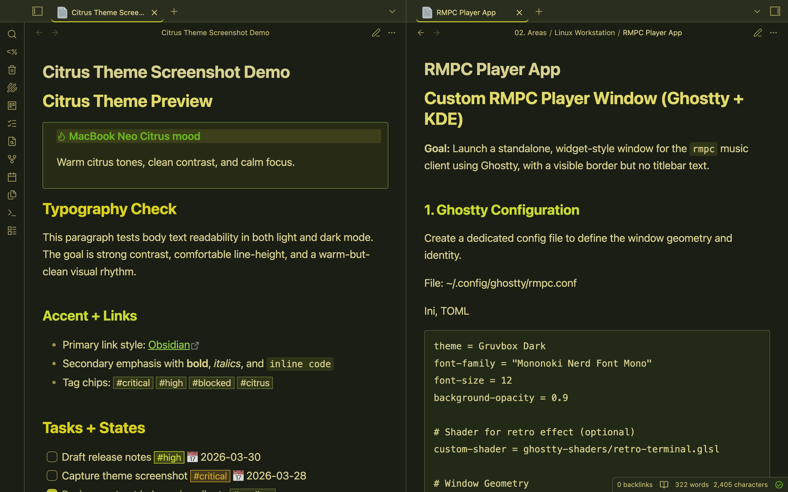
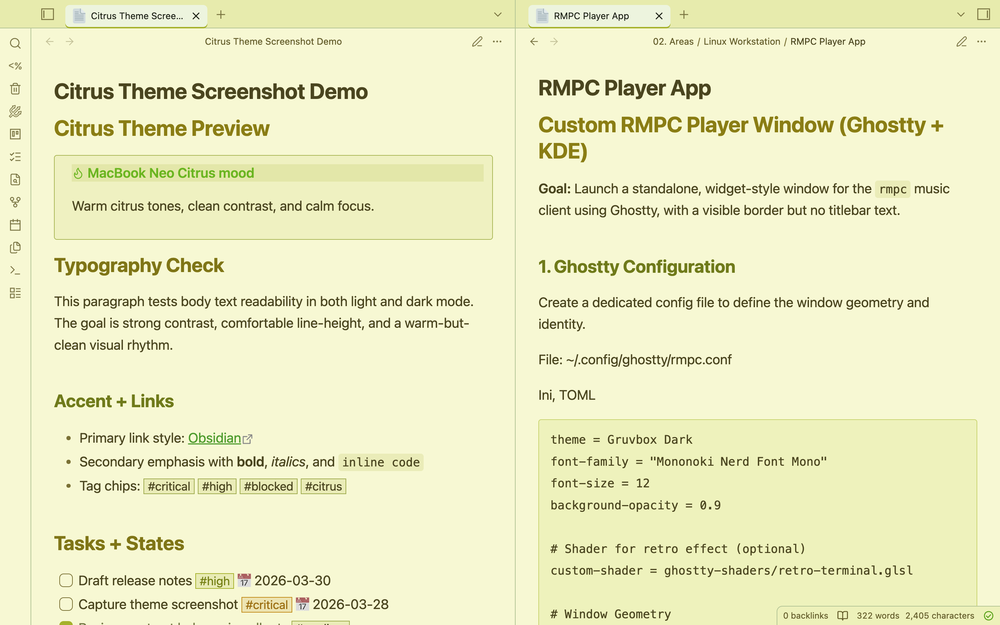

# Citrus Neo Theme

The Citrus Neo Theme is an [Obsidian](https://obsidian.md) theme inspired by the **MacBook Neo Citrus** color scheme.

It blends warm citrus yellows and greens with high-contrast typography to create a focused workspace that still feels vibrant.

## Highlights

- Balanced light and dark palettes with consistent contrast
- Readable headings with citrus-accented hierarchy
- Styled callouts, tags, tasks, tables, and code blocks
- OS-adaptive interface/text fonts inspired by Cupertino theme conventions
- Monospace-friendly code rendering for notes and snippets

## Inspiration

This theme draws from the MacBook Neo Citrus visual style: lively citrus tones, earthy depth, and clean readability for long writing sessions.

## Installation

### From Obsidian (after publication)

1. Open **Settings -> Appearance -> Themes**
2. Click **Manage**
3. Search for **Citrus Neo**
4. Install and enable it

### Manual install

1. Open your vault folder
2. Go to `.obsidian/themes/`
3. Create a folder named `Citrus Neo`
4. Place `manifest.json` and `theme.css` inside it
5. Reload Obsidian and select **Citrus Neo**

## Credits

- Inspired by the MacBook Neo Citrus color scheme
- Built for the Obsidian community

